# NeatNotes ReadME

## Introduction

Welcome to NeatNotes, a clean, simple app where user experience is paramount. The site is a great place to store your notes whether it be two words or an essay! The layout is simple, meaning it's easy to stay organised with your notes. The app can be used by anyone with internet access, so create an account and start noting, safe in the knowledge that your account is private and secure.

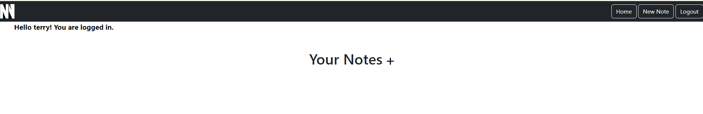

**[Deployed Site](https://neatnotes-273c093a6f6f.herokuapp.com/neat/notes/)**

## Agile Approach
An Agile approach was taken in the planning and production of the app. This entailed identifying themes which helped to create user stories that attempt to capture the needs and desires of the user in relation to the app. Once identified, the user stories were added to a Kanban board: a place to organise and keep track of tasks. Due to the tight deadline, it was important to remain true to the Agile methodology, and complete the basic needs before moving onto less important functionality and style.

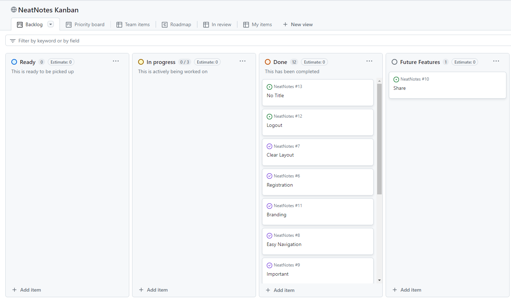

## User Stories
**As a user I want to create a note to help keep my life organised.**

Acceptance Criteria:
- button to create a note
- interface for user input of title and text
- button to save note

**As a user I want to be able to view my saved notes, so that I can come back to them in the future.**

Acceptance Criteria:
- menu of saved notes.
- note loads when click on title in menu

**As a user I want to be able to update my notes, so that I can make changes to them.**

Acceptance Criteria:
- When the user clicks on a note there will be an edit button, making the text and title editable.
- save button will update the note

**As a user I want to be able to delete a note so that I can get rid of old notes I don't need anymore.**

Acceptance Criteria:
- button to delete note
- alert to confirm deletion or go back

**As a user I want to be able to login so that I can privately view, create, update and delete my personal notes.**

Acceptance Criteria:
- front end form to input login details
- login details checked backend
- messages to tell user if the username/password is incorrect
- submit button

**As a user, I want to be able to logout, so I know my notes are secure when I am not using the app.**

Acceptance Criteria:
- button for logging out
- confirmation message when logged out
- no access to site until logged in again

**As a user I want to be able to register so that I can create an account and login in the future.**

Acceptance Criteria:
- front end form for user details
- account created upon form submission
- user can login next time

**As a user I want a site that is clearly laid out so that I can see my notes clearly.**

Acceptance Criteria:
- clean, simple frontend layout for easy reading
- buttons purpose are either labelled or otherwise obvious

**As a user I want to be able to navigate the site easily, so that I have a better user experience.**

Acceptance Criteria:
- clear buttons to bring up a list of saved notes
- clicking on a note title will bring it up
- clear logout button

**As a user I want to be able to label a note as important, so that I can see my more important notes in one place.**

Acceptance Criteria:
- button next to each note to mark as important
- important notes added to new set in the backend
- button to undo important label and send back to normal notes

**As a site owner, I want a nice logo and colours to advertise my brand.**

Acceptance Criteria:
- well designed logo
- harmonious colour palette chosen

**As a user I want to be able to make a quick note without having to worry about the title, so that I can make a note faster.**

Acceptance Criteria:
- The title field autofilled with the first three words of the note if no title is specified upon created of the note.

**As a user I want to be able to share my notes, so that others can view them.**

Acceptance Criteria:
- share button next to save button
- functionality implemented to email note to others

**As a user, I want to see my username somewhere on the page so I know I'm logged in.**

Acceptance Criteria:
- Use a template variable to display the username on the site.
- must be clearly visable

## Planning

### Design

The design is simple, as I believe a notes app should be, using only black and white, and with no intrusive content on the page. Most of the styling is done via bootstrap's built in classes: the navbar is built using .navbar-dark and buttons with .btn-dark. The view, create and edit forms use bootstrap's .card class. There is no styling on the text, aside from the user's name which is in white.

I designed a logo for the site which I placed in the navbar and as a favicon. Go to [Features](#logo) for more on the logo.

I used fontawesome for the plus sign on the homepage.

### Wireframes

I created wireframes on Balsamiq in order to visualise the layout of the site. [View all wireframes in this document.](docs/NeatNotesWireframes.bmpr)

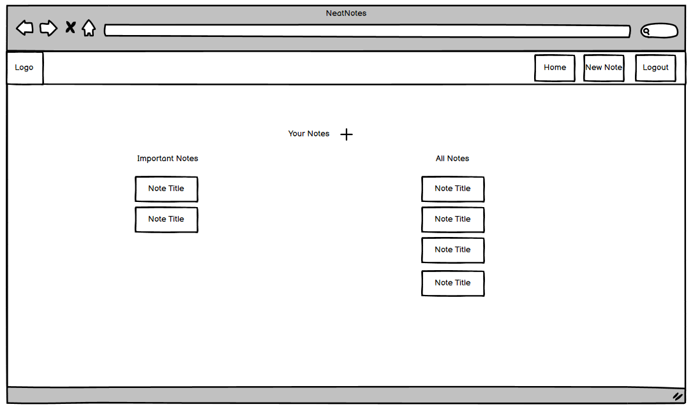

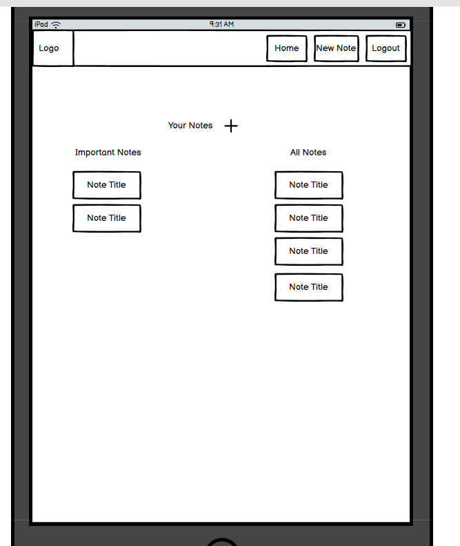

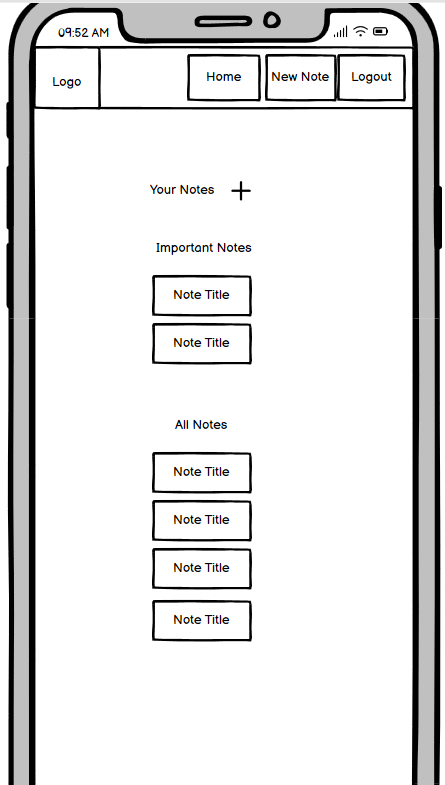

### Workflow

I created workflow diagram to help me understand the path a user would take on the site, as well as the required logic to implement it.

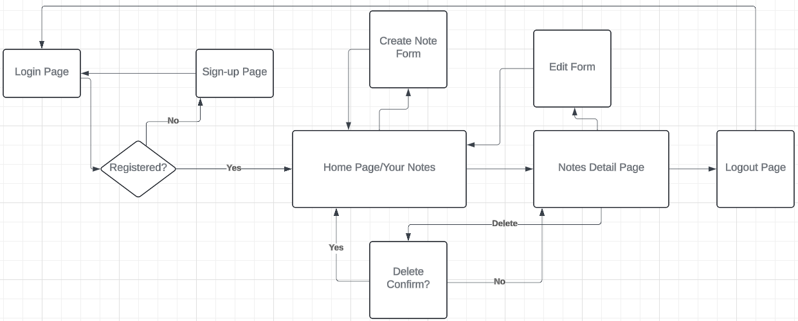

### Models
I created a custom model with the following fields:

|      Name            |     Type                   |     Key  |
|----------------------|----------------------------|----------|
|      user            |     User Model             |     FK   |
|      title           |     CharField              |          | 
|      text            |     CharField  dropdown    |          |
|      Created         |     CharField  dropdown    |          |
|      is_important    |     Boolean                |          |

### Capstone Project Planning

I used dbdiagrams to define my database tables. It was useful as an overview of the database, and served me well as a reference while working on the backend logic.

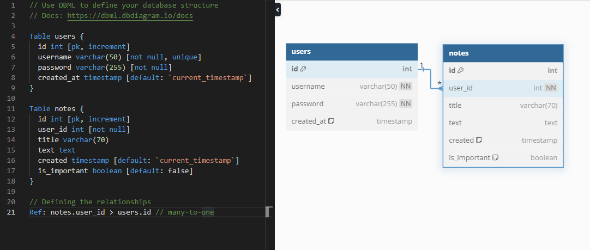

#### Planning my Django Apps and Views

##### App: Home

###### Models: User

###### Views

- SignupView: handles user registration.
- LoginInterfaceView: sends user to homepage when logged in.
- LogoutInterfaceView: sends user to logout page when logging out.
- HomeView: logged in users sent to home

##### App: notes

##### Models: Notes

##### Views

- NotesDeleteView: allows user deletion of notes.
- NotesUpdateView: allows user editing notes.
- NotesCreateView: allows user to create a note.
- NotesListView: handles template to view notes.
- NotesDetailView: handles template to view note detail.
- toggle_important: handles note important status.

## Features

### Register

New users are able to register with a username and password, allowing them to login and create notes privately.

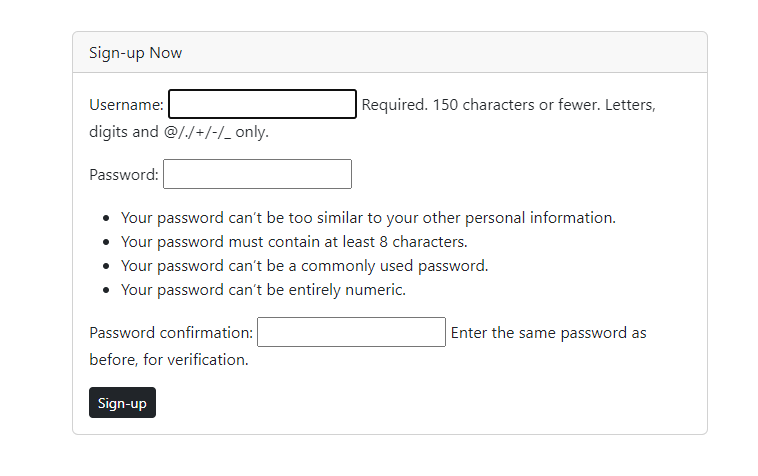

Users are notified when they sign-up:

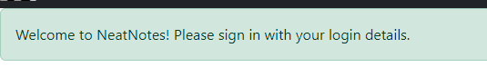

**Related User Story: As a user I want to be able to register so that I can create an account and login in the future.**
 

**[Testing](#feature-and-user-story-testing): Feature and userstory pass**

### Login

Registered users can login using the form, allowing them access to the site.

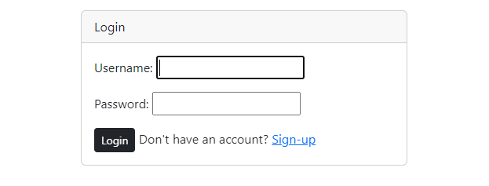

Users are notified when they login:

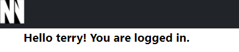

**Related User Story: As a user I want to be able to login so that I can privately view, create, update and delete my personal notes.**
 

**[Testing](#feature-and-user-story-testing): Feature and userstory pass**

### Logout 

Logged-in users can securely logout.

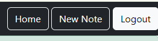

Users are given confirmation of logging out and a thank you message. There is no django notification as it is already in the template.

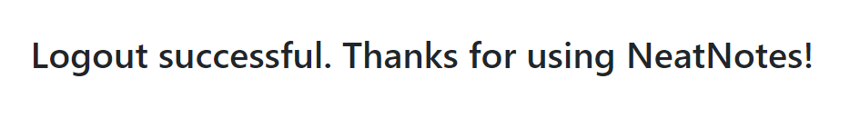

**Related User Story: As a user, I want to be able to logout, so I know my notes are secure when I am not using the app.**
 

**[Testing](#feature-and-user-story-testing): Feature and user story pass**

### Navbar

Navigation is made simple by the navbar. Logged-in users can navigate between home, logout and new note. The logo also links to the homepage.

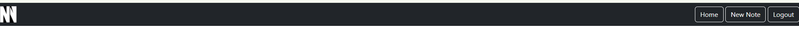

Users not logged-in see this navbar where they can login or sign-up.

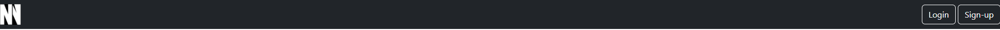

**Related User Story: As a user I want to be able to navigate the site easily, so that I have a better user experience.**
 

**[Testing](#feature-and-user-story-testing): Feature and user story pass**

### Create Note

Users can create and save notes. They can either use the navbar...

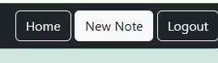

... or the plus sign to do this.

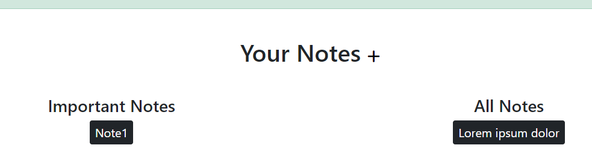

Users are notified upon successful creation of notes.

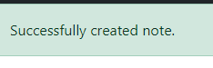

**Related User Story: As a user, I want to create a note to help keep my life organised.**
 

**[Testing](#feature-and-user-story-testing): Feature and user story pass**

### Delete Note

Users can delete notes they no longer need or want.

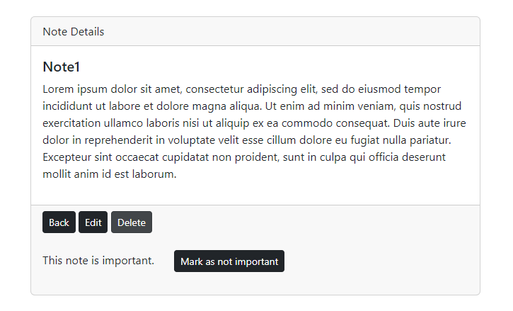

 There is a confirmation message to ensure no accidental deletions.

 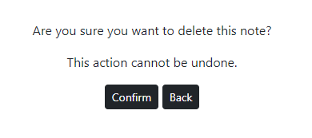

**Related User Story: As a user I want to be able to delete a note so that I can get rid of old notes I don't need anymore.**
 

**[Testing](#feature-and-user-story-testing): Feature and user story pass**

### Edit

Users can edit their notes.

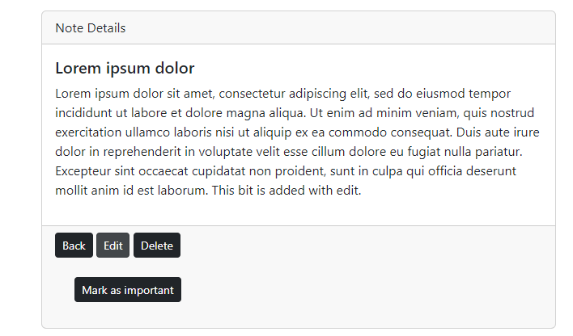
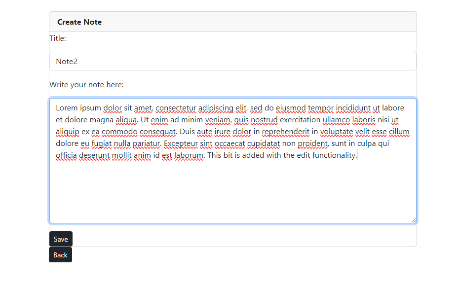

They are notified upon successful update of their note.

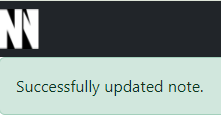

**Related User Story: As a user I want to be able to update my notes, so that I can make changes to them.**
 

**[Testing](#feature-and-user-story-testing): Feature and user story pass**

### View

Users can view their notes in one place...

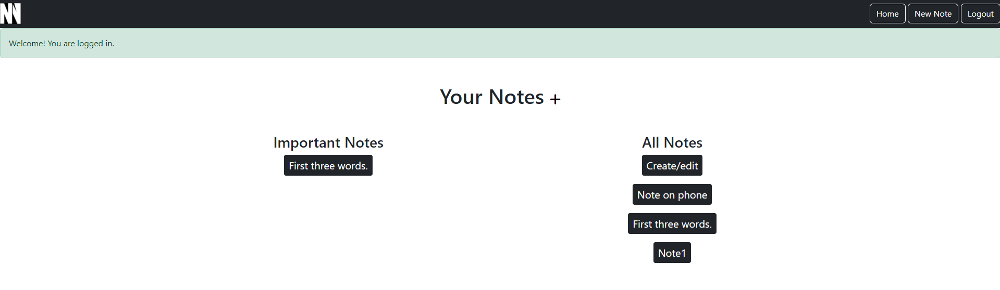

 ... or click the title to view the contents.

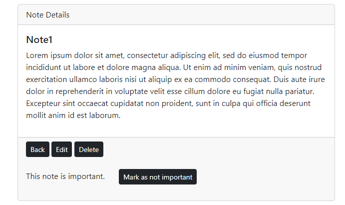 

**Related User Story: As a user I want to be able to view my saved notes, so that I can come back to them in the future.**
 

**[Testing](#feature-and-user-story-testing): Feature and user story pass**

### Mark as Important

Users can mark a note as important; this will be saved in the backend. There is a message next to the 'Mark as important' button that tells the user if the message has been marked important. The text on the button toggles between 'Mark as important' and 'Mark as not important'.

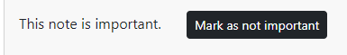

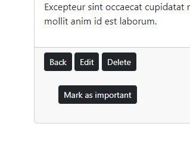

Once a note is marked as important, the layout of the homepage is changed; important notes are kept on the left, and all notes are kept on the right. Note that important notes will appear in both columns.

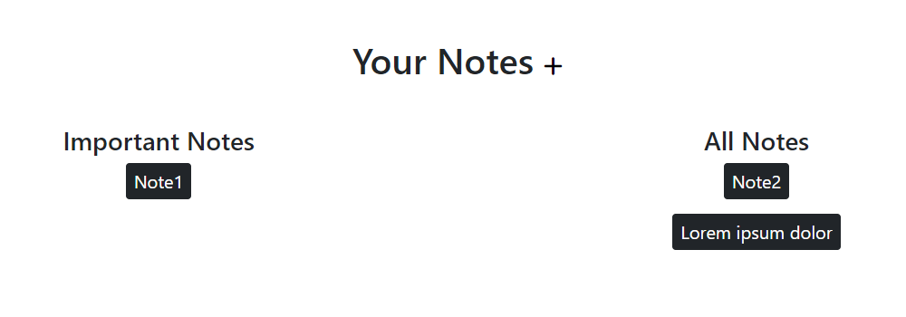

**Related User Story: As a user I want to be able to label a note as important, so that I can see my more important notes in one place.**
 

**[Testing](#feature-and-user-story-testing): Feature and user story pass**

### Username in Navbar

Users like to see their username somewhere on the page so they know they are logged in, but also because their experience of the site feels more personalised.

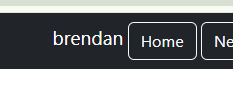

**Related User Story: As a user, I want to see my username somewhere on the page so I know I'm logged in.**

**[Testing](#feature-and-user-story-testing): Feature and user story pass**

### No Title Field Required

Sometimes users don't want to think of a title for their note - maybe they just need to quickly note something down and it doesn't need a title. I have implemented functionality that takes the first three words from the content of the note and sends it to the title field, allowing the user to leave the title blank, but still ensuring there is some title for their later reference.

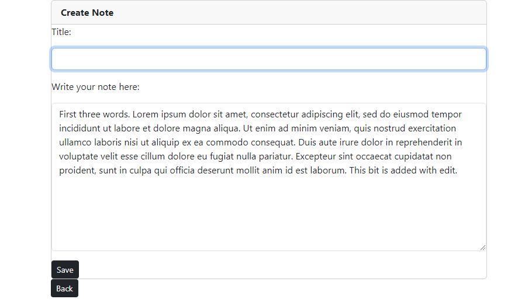

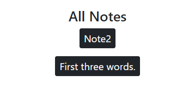

**Related User Story: As a user I want to be able to make a quick note without having to worry about the title, so that I can make a note faster.**
 

**[Testing](#feature-and-user-story-testing): Feature and user story pass**

### Logo

As a site owner I wanted a logo for my brand that is simple, distinctive and quickly recognisable. I designed a white logo for the navbar, then inverted the colours to make a black one for the favicon. I designed it on microsoft paint.

**Related User Story: As a site owner, I want a nice logo and colours to advertise my brand.**
 

**[Testing](#feature-and-user-story-testing):**
Testing this feature and userstory is more difficult; I am happy with the logo, but whether the logo is nice is subjective. I am also happy with the simple black and white colour scheme, so I will consider this user story and feature as passed.

## Testing

### Responsiveness

The site is fully responsive on all screen sizes. However, the only instance where alternative formatting is required is on the homepage for mobile phones, and only when the user has some notes in the 'important' catagory. I tested all pages regardless, finding that they are indeed fully responsive. 

#### Phone

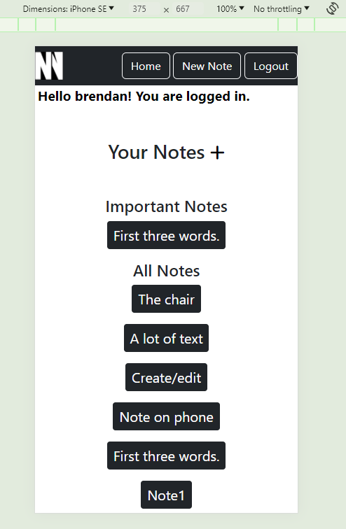

#### Tablet

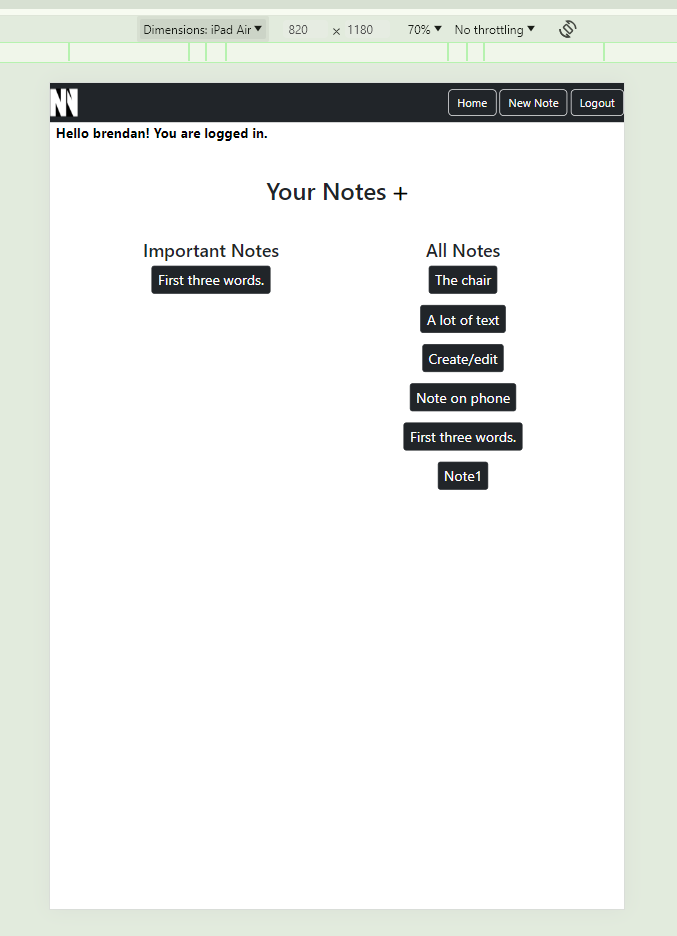

#### Desktop

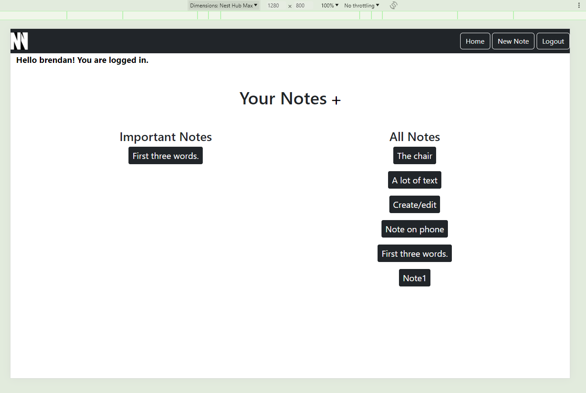

### Browser Compatability

|                         | Chrome   | Edge     | Firefox  | Safari   | Opera |
|-------------------------|----------|----------|----------|----------|-------|
| Intended Appearance?    | Yes      | Yes      | Yes      | No       | Yes   |
| Intended Responsiveness?| Yes      | Yes      | Yes      | Yes      | Yes   |

**Notes:**
Firefox, Safari and Opera highlights form fields in blue rather than black when clicked on. However, I did not implement this feature, hence the 'Yes' in the table for Firefox and Opera.

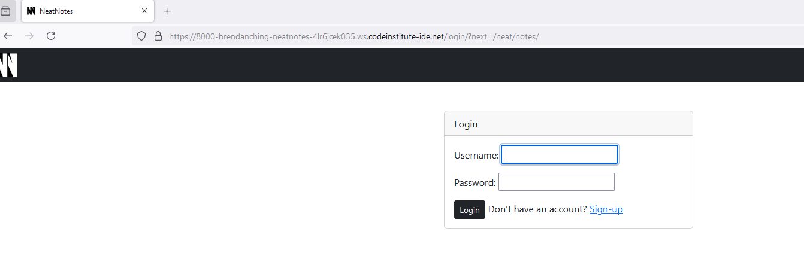

Safari renders the navbar in a dark navy blue, rather than black.

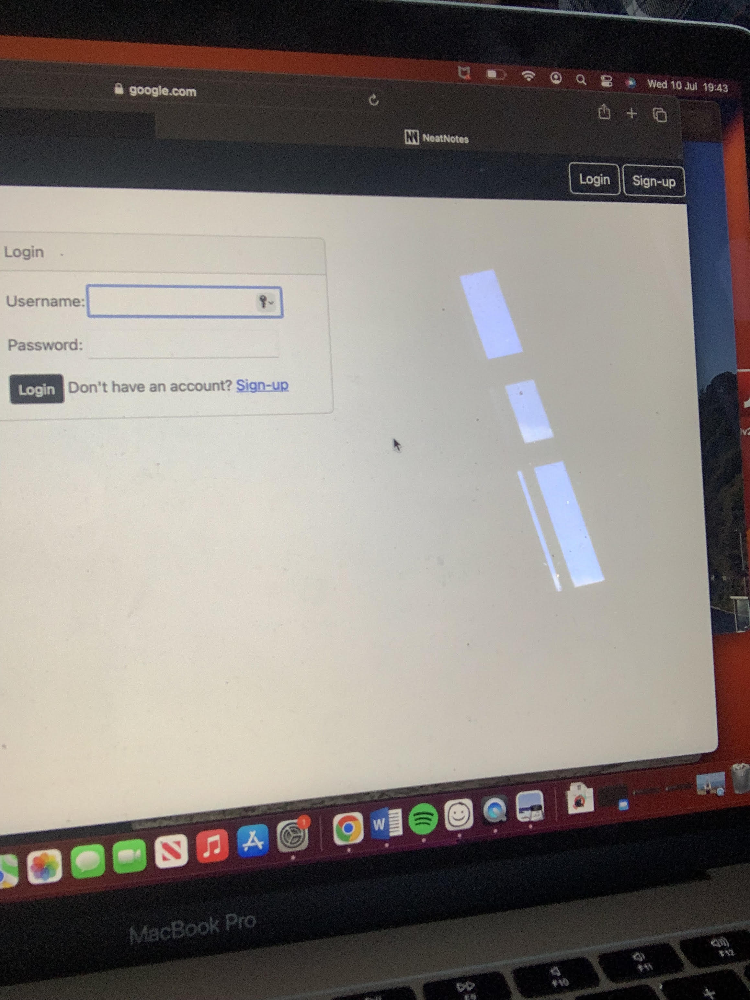

## Bugs (all now fixed)

### Not all Notes showing under 'All Notes'
On the notes list page, my intention was to have notes marked as important on the left and all notes on the right. However I mistakenly wrote logic to display important notes on the left, but only none-important notes on the right. It was an easy fix by simply removing an if statement.

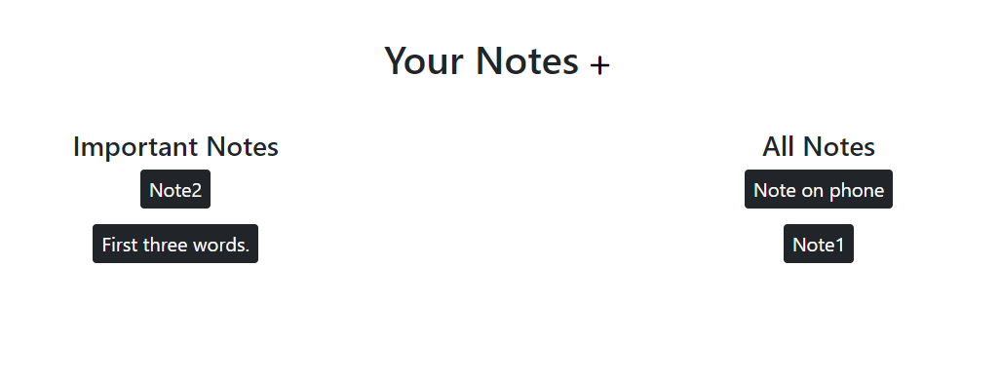

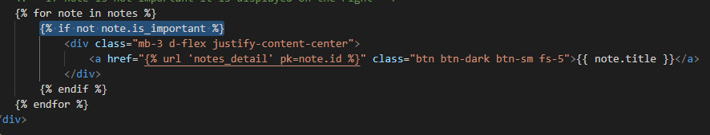

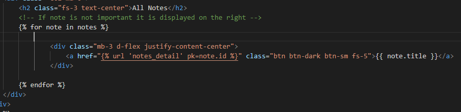

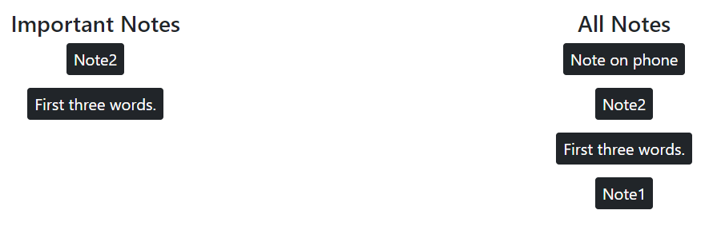

### Users Name not showing in the Navbar
I had a problem with displaying the users name in the navbar. Initially, I thought it hadn't rendered at all, but upon inspection of the element, I found that it was rending as black on black, ignoring my css file that specifies white text. I had not run 'collect static', when I did, it worked, showing the username in white over the navbar.

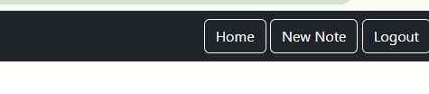

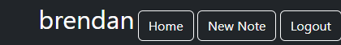

### Problems with Deployment
I had added an unnecessary directory which held all my apps inside it. This initially only caused a few minor complications with link pathing, but I worked around it, thinking it was fine, but when I came to deploy, heroku threw the errors, 'build failed' and 'push rejected'. After some googling, I realised the unnecessary folder meant heroku was unable to identify my project as a django application. I was concerned this would become a tedious task of moving all my files into new folders one by one before deleting the problematic folder, but chatgpt gave me the command, 'mv folder_name/* .' which moved everything out the parent directory. I then deleted the folder, and it worked!

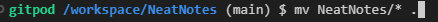

### 'Create' Success Messages not Showing
All success messages for sign-up, login, create, delete and edit were not working initially, however I quickly realised I had not imported 'SuccessMessageMixin' to my view, when I did, I believed I had solved the issue and moved on. Upon testing, however, I noticed the create notification was not showing up. Inspecting the create view, I found that the function that identifies the user and saves the note to their database table, was stopping the success message. I added one line of code to fix this: messages.success(self.request, self.success_message).

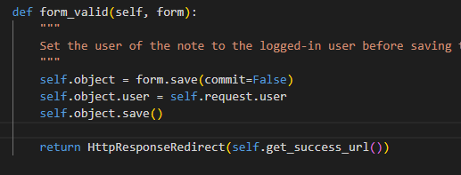

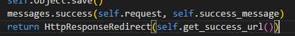

### Important Button Functionality
I initially attempted to use ajax javascript to implement functionality to mark notes as important. I struggled to get it to work, so looked for alternative methods, finding that a function based view was a simpler and cleaner solution. The functionality then worked.

## Lighthouse Performace Testing
### Mobile
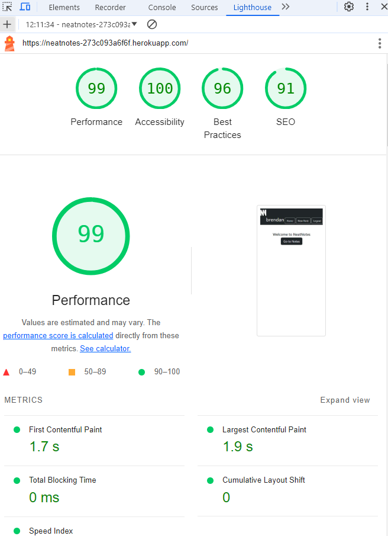
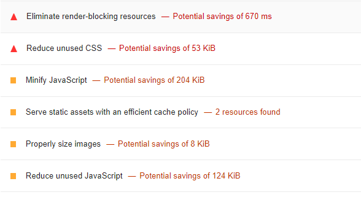

### Desktop
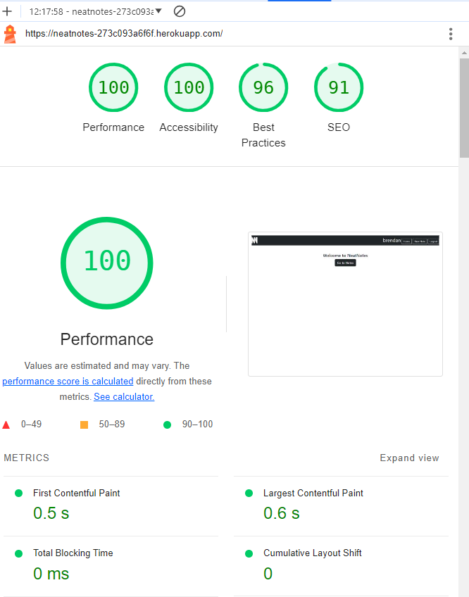
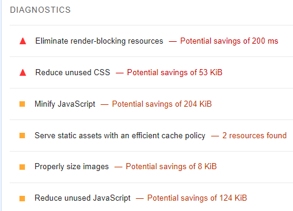

### Feature and User Story Testing
This is documented in the features section where each feature is shown working, along with the user story it satisfies. [Go back to Features](#features) or click on a user story to view the specific feature relating to it. You can return here easily by clicking on 'Testing' under each feature. User stories not addressed by the features section are shown below the user stories.

**[As a user I want to create a note to help keep my life organised.](#create-note)**

**[As a user I want to be able to view my saved notes, so that I can come back to them in the future.](#view)**

**[As a user I want to be able to update my notes, so that I can make changes to them.](#edit)**

**[As a user I want to be able to delete a note so that I can get rid of old notes I don't need anymore.](#delete-note)**

**[As a user I want to be able to login so that I can privately view, create, update and delete my personal notes.](#login)** 

**[As a user, I want to be able to logout, so I know my notes are secure when I am not using the app.](#logout)**

**[As a user I want to be able to register so that I can create an account and login in the future.](#register)**

**As a user I want a site that is clearly laid out so that I can see my notes clearly.**

**[As a user I want to be able to navigate the site easily, so that I have a better user experience.](#navbar)**

**[As a user I want to be able to label a note as important, so that I can see my more important notes in one place.](#mark-as-important)**

**[As a site owner, I want a nice logo and distinctive colours to advertise my brand.](#logo)**

**[As a user I want to be able to make a quick note without having to worry about the title, so that I can make a note faster.](#no-title-field-required)**

**As a user I want to be able to share my notes, so that others can view them.**

**[As a user, I want to see my username somewhere on the page so I know I'm logged in.](#username-in-navbar)**

#### Unaddressed User Story

**As a user I want a site that is clearly laid out so that I can see my notes clearly.**

I believe this user story passes testing as the site is very clear and simple.

#### User Story not Satisfied:

**As a user I want to be able to share my notes, so that others can view them.**

The functionality for this was not implemented due to complexity and lack of time. I had decided not to do this during planning and it was marked as 'Won't do' on Github.

## Code Validation

| Language | Validator                                     |
|----------|-----------------------------------------------|
| HTML     | https://validator.w3.org/                     |
| CSS      | https://jigsaw.w3.org/css-validator/validator |
| Python   | https://pep8ci.herokuapp.com/                 |

There is no Javascript to validate.

### HTML and CSS

I encountered a few errors while validating my code, most of which were easy fixes. However, there are some errors caused by bootstrap and django which cannot be changed. I carefully checked these errors to make sure they were not mine.

All HTML and CSS files validated:
- home
  - login.html
  - logout.html
  - register.html
  - welcome.html
- notes
  - notes_delete.html
  - notes_detail.html
  - notes_form.html
  - notes_list.html
- static
  - style.css
  - base.html

**View screenshots of all validations [here.](https://github.com/BrendanChing/NeatNotes/tree/main/static/images/html_css_validation)**

### Python

I encountered some errors while validating my python code. These were mostly due to empty spaces at the end of lines and lines being too long. All errors were fixed, then revalidated. All python files have now been validated with no errors.

All Python Files Validated:
- home
  - admin.py
  - apps.py
  - models.py
  - tests.py
  - urls.py
  - views.py
- neatnotes
  - asgi.py
  - settings.py
  - urls.py
  - wsgi.py
- notes
  - admin.py
  - apps.py  
  - forms.py
  - models.py
  - tests.py
  - urls.py
  - views.py

**View screenshots of all validations [here.](https://github.com/BrendanChing/NeatNotes/tree/main/static/images/python_validation)**

## Future Features

### Share

As per the unfulfilled user story, it would be a nice if users could share their notes via email or social media. The implementation of this, however, would be quite time consuming.

### Search

A search bar would be useful for users with a lot of notes.

### Folders

Allow the user to create folders which would be shown on the homepage that they could put notes in for better organisation.

## Technologies

- [HTML](https://en.wikipedia.org/wiki/HTML) used for the main site content.
- [CSS](https://en.wikipedia.org/wiki/CSS) used for the main site design and layout.
- [Python](https://www.python.org) used as the back-end programming language.
- [Git](https://git-scm.com) used for version control.
- [GitHub](https://github.com) used for secure online code storage.
- [Heroku](https://www.heroku.com) used for hosting the deployed site.
- [Gitpod](https://gitpod.io) used as a cloud-based IDE for development.
- [Bootstrap](https://getbootstrap.com) used as the front-end CSS framework for modern responsiveness and pre-built components.
- [Django](https://www.djangoproject.com) used as the Python framework for the site.
- [PostgreSQL](https://www.postgresql.org) used as the relational database management.

### Heroku Deployment

I encountered some problems with deployment that can be viewed in the bugs section under [Problems with Deployment](#problems-with-deployment). The steps below are copied directly from [this readme by doctypeKieran](https://github.com/doctypeKieran/ci-capstone-project/blob/main/README.md), showing the correct steps (which I later took) to deploy to heroku.

Steps:

1. Created a new app on Heroku
2. Created a unique name for the app
3. Selected the region for the app
4. Selected "Create App"

In my workspace:

1. Installed gunicorn
2. `pip3 freeze --local > requirements.txt`
3. Created a Procfile
4. Added a line of code for Heroku deployment: `web: gunicorn neatnotes.wsgi`

Then back to Heroku:

1. Clicked on the "Settings" tab
2. Clicked to "Reveal config vars"
3. Set the following environmental variables:
  - `DATABASE_URL`
  - `SECRET_KEY`
  - *These variables were also stored in a file, `env.py`, which is ignored by the git version control by being placed in the `.gitignore` file*

4. Connected the app to GitHub
  - Went to the "Deploy" tab
  - Selected "GitHub" as the deployment method
  - Provided the URL to my GitHub repository
  - Ensured that the "main" branch was where the app was being deployed from
  - Clicked "Deploy Branch"
  - Opened the app to ensure it was successfully deployed

  **[Deployed Link](https://neatnotes-273c093a6f6f.herokuapp.com/)**

  ## Credits
- ChatGPT used for debugging
- Code Institute LMS
- Balsamiq used for wireframes
- Logo created in Microsoft Paint
- Various YouTube videos:
    - I used [Python Django Tutorial for Beginners by Programming with Mosh](https://www.youtube.com/watch?v=rHux0gMZ3Eg&t=895s&ab_channel=ProgrammingwithMosh) to help me understand the basics of django.
    - I used [Django 4 Note-Taking App Tutorial by Prime Inspire](https://www.youtube.com/watch?v=QdBjcdAZPFQ&list=PLi9pEBARzYqCpCOtIZ1oRoT2xadIDc8Ya&ab_channel=PrimeInspire) to help me with the basic setup and login functionality. I also used some of the same stlyes, such as the bootstrap navbar and cards.
    - I used [What are Django class based views & should you use them? by Dennis Ivy](https://www.youtube.com/watch?v=RE0HlKch_3U&ab_channel=DennisIvy) to help me understand class based views.
    - I used [Django Tutorial by Net Ninja](https://www.youtube.com/watch?v=3EzKBFc9_MQ&ab_channel=NetNinja) at various times to help with my general understanding of django.
- [Bootstrap Documentation](https://getbootstrap.com/docs/5.0/getting-started/introduction/)
- [fontawesome](https://fontawesome.com/) was used for the plus sign.
- [doctypeKieran's](https://github.com/doctypeKieran) readme for heroku deployment steps.