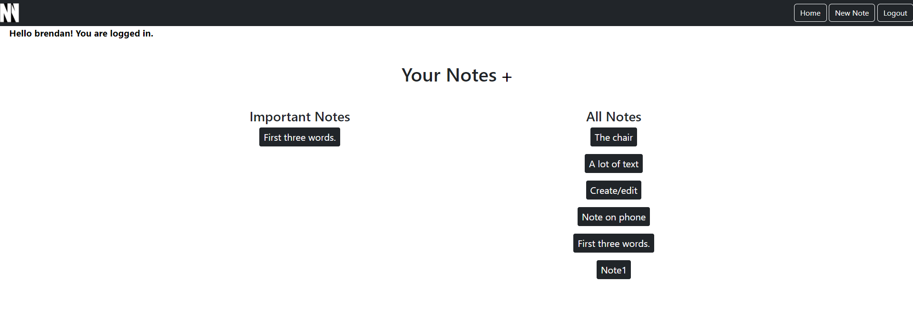
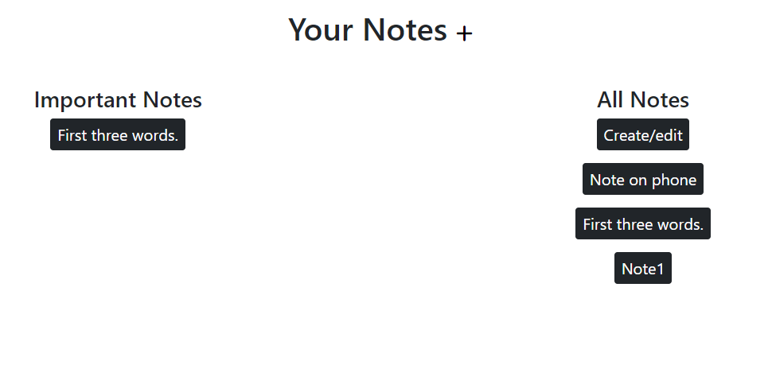

# NeatNotes ReadME

## Introduction

Welcome to NeatNotes, a clean and simple app where user experience is paramount.

**[Deployed Site](https://neatnotes-273c093a6f6f.herokuapp.com/neat/notes/)**

## Agile Approach
An Agile approach was taken in the planning and production of the app. This entailed identifying themes which helped to create user stories that attempt to capture the needs and desires of the user in relation to the app. Once identified, the user stories were added to a Kanban board: a place to organise and keep track of tasks. Due to the tight deadline, it was important to remain true to the Agile methodology, and complete the basic needs before moving onto less important functionality and style.

## User Stories
**As a user I want to create a note to help keep my life organised.**

Acceptance Criteria:
- button to create a note
- interface for user input of title and text
- button to save note

**As a user I want to be able to view my saved notes, so that I can come back to them in the future.**

Acceptance Criteria:
- menu of saved notes.
- note loads when click on title in menu

**As a user I want to be able to update my notes, so that I can make changes to them.**

Acceptance Criteria:
- When user clicks on a note there will be an edit button, making the text and title editable
- Save button will update the note

**As a user I want to be able to delete a note so that I can get rid of old notes I don't need anymore.**

Acceptance Criteria:
- Button to delete note
- Alert to confirm deletion or go back

**As a user I want to be able to login so that I can privately view, create, update and delete my personal notes.**

Acceptance Criteria:
- Front end form to input login details
- Login details checked backend
- Messages to tell user if the email/password is incorrect
- Submit button

**As a user, I want to be able to logout, so I know my notes are secure when I am not using the app.**

Acceptance Criteria:
- Button for logging out
- Confirmation message when logged out
- No access to site until logged in again

**As a user I want to be able to register so that I can create an account and login in the future.**

Acceptance Criteria:
- Front end form for user details
- Account created upon form submission
- User can login next time

**As a user I want a site that is clearly laid out so that I can see my notes clearly.**

Acceptance Criteria:
- Clean, simple frontend layout for easy reading
- Buttons purpose are either labelled or otherwise obvious

**As a user I want to be able to navigate the site easily, so that I have a better user experience.**

Acceptance Criteria:
- Clear buttons to bring up a list of saved notes
- Clicking on a note title will bring it up
- Clear logout button

**As a user I want to be able to label a note as important, so that I can see my more important notes in one place.**

Acceptance Criteria:
- Star button next to each note to mark as important
- Important notes added to new set in the backend
- Button to undo important label and send back to normal notes

**As a site owner, I want a nice logo and distinctive colours to advertise my brand.**

Acceptance Criteria:
- Well designed logo
- Harmonious colour palette chosen

**As a user I want to be able to make a quick note without having to worry about the title, so that I can make a note faster.**

Acceptance Criteria:
- Title field autofilled with the first three words of the note if no title is specified upon created of the note.

**As a user I want to be able to share my notes, so that others can view them.**

Acceptance Criteria:
- Share button next to save button
- Functionality implemented to email note to others

## Planning

### Wireframes

I created wireframes on Balsamiq in order to visualise the layout of the site. While the finished product differs from the wireframes quite significantly, they still served me well as a 
rough guide. Some features shown in the wireframes have not been implemented due to a lack of time. The design is simple as I believe a notes app should be, using only black and white, and 
with no intrusive content on the page.

[Link to wireframes document](docs/wireframes.bmpr)

### Workflow

I created workflow diagram to help me understand the path a user would take on the site, as well as the required logic to implement it.

### Models
I created a custom model with the following fields:

|      Name            |     Type                   |     Key  |
|----------------------|----------------------------|----------|
|      user            |     User Model             |     FK   |
|      title           |     CharField              |          | 
|      text            |     CharField  dropdown    |          |
|      Created         |     CharField  dropdown    |          |
|      is_important    |     Boolean                |          |

### Capstone Project Planning

I used dbdiagrams to define my database tables. It was useful as an overview of the database, and served me well as a reference while working on the backend logic.

#### Planning my Django Apps and Views

##### App: Home

###### Models: User

###### Views

- SignupView: handles user registration.
- LoginInterfaceView: sends user to homepage when logged in.
- LogoutInterfaceView: sends user to logout page when logging out.
- HomeView: logged in users sent to home

##### App: notes

##### Models: Notes

##### Views

- NotesDeleteView: allows user deletion of notes.
- NotesUpdateView: allows user editing notes.
- NotesCreateView: allows user to create a note.
- NotesListView: handles template to view notes.
- NotesDetailView: handles template to view note detail.
- toggle_important: handles note important status.

## Features

### Register

New users are able to register with a username and password, allowing them to login and create notes privately.

**Related User Story: As a user I want to be able to register so that I can create an account and login in the future.**
 

**Testing: pass.**

### Login

Registered users can login using the form, allowing them access to the site.

Users are notified when they login:

**Related User Story: As a user I want to be able to login so that I can privately view, create, update and delete my personal notes.**
 

**Testing: pass.**

### Logout 

Logged-in users can securely logout.

Users are given confirmation of logging out and a thank you message. There is no django notification as it is already in the template.

**Related User Story: As a user, I want to be able to logout, so I know my notes are secure when I am not using the app.**
 

**Testing: pass.**

### Navbar

Navigation is made simple by the navbar. Users can navigate between, home, logout and new note. The logo also links to the homepage.

**Related User Story: As a user I want to be able to navigate the site easily, so that I have a better user experience.**
 

**Testing: pass.**

### Create Note

Users can create and save notes. They can either use the navbar...

... or the plus sign to do this.

Users are notified upon successful creation of notes.

**Related User Story: As a user, I want to create a note to help keep my life organised.**
 

**Testing: pass.**

### Delete Note

Users can delete notes they no longer need or want.

 There is a confirmation message to ensure no accidental deletions.

 

**Related User Story: As a user I want to be able to delete a note so that I can get rid of old notes I don't need anymore.**
 

**Testing: pass.**

### Edit

Users can edit their notes.

They are notified upon successful update of their note.

**Related User Story: As a user I want to be able to update my notes, so that I can make changes to them.**
 

**Testing: pass.**

### View

Users can view their notes in one place...

 ... or click the title to view the contents.

 

**Related User Story: As a user I want to be able to view my saved notes, so that I can come back to them in the future.**
 

**Testing: pass.**

### Mark as Important

Users can mark a note as important; this will be saved in the backend. There is a message next to the 'Mark as important' button that tells the user if the message has been marked important. The text on the button toggles between 'Mark as important' and 'Mark as not important'.

Once a note is marked as important, the layout of the homepage is changed; important notes are kept on the left, and all notes are kept on the right. Note that important notes will appear in both columns.

**Related User Story: As a user I want to be able to label a note as important, so that I can see my more important notes in one place.**
 

**Testing: pass.**

### No Title Field Required

Sometimes users don't want to think of a title for their note - maybe they just need to quickly note something down, and it doesn't need a title. I have implemented functionality that takes the first three words from the content of the note and sends it to the title field, allowing the user to leave the title blank, but still ensuring there is some title for their later reference.

**Related User Story: As a user I want to be able to make a quick note without having to worry about the title, so that I can make a note faster.**
 

**Testing: pass.**

## Testing

### Responsiveness

The site is fully responsive on all screen sizes. However, the only instance where alternative formatting is required is on the homepage for mobile phones, and only when the user has some notes in the 'important' catagory. All other pages have responsive django forms and nothing else.

#### Phone

#### Tablet

#### Desktop

### Browser Compatability

|                         | Chrome   | Edge     | Firefox  | Safari   | Opera |
|-------------------------|----------|----------|----------|----------|-------|
| Intended Appearance?    | Yes      | Yes      | Yes      | No       | Yes   |
| Intended Responsiveness?| Yes      | Yes      | Yes      | Yes      | Yes   |

**Notes:**
Firefox, Safari and Opera highlights form fields in blue rather than black when clicked on. However, I did not implement this feature, hence the 'Yes' in the table for Firefox and Opera.

Safari renders the navbar in a dark navy blue, rather than black.

## Bugs

### Not all Notes showing under 'All Notes'
On the notes list page, my intention was to have notes marked as important on the left and all notes on the right. However I mistakenly wrote logic to display important notes on the left, but only none-important notes on the right. It was an easy fix by simply removing an if statement.

### Users Name not showing in the Navbar
I had a problem with displaying the users name in the navbar. Initially, I thought it hadn't rendered at all, but upon inspection of the element, I found that it was rending as black on black, ignoring my css file that specifies white text. I had not run 'collect static', when I did, it worked, showing the username in white over the navbar.

### Problems with Deployment
I had added an additional directory which held all my apps inside it. This initially only caused a few minor complications with link pathing, but I worked around it, thinking it was fine, but when I came to deploy, heroku threw the errors, 'build failed' and 'push rejected'. After some googling, I realised the unnecessary folder meant heroku was unable to identify my project as a django application. I was concerned this would become a tedious task of moving all my files into new folders one by one before deleting the unnecessary folder, but chatgpt gave me the command 'mv folder_name/* .' which moved everything out the parent directory. I then deleted the folder, and it worked!

### Create Success Messages not Showing
All success messages for sign-up, login, create, delete and edit were not working initially, however I quickly realised I had not imported 'SuccessMessageMixin' to my view, when I did, I believed I had solved the issue, and moved on. Upon testing, however, I noticed the create notification was not showing up. Inspecting the create view, I found that the function that identifies the user and saves the note to their database table, was stopping the success message. I added one line of code to fix this: messages.success(self.request, self.success_message).

### Important Button Functionality
I initially attempted to use ajax javascript to implement functionality to mark notes as important. I struggled to get it to work, so looked for alternative methods, finding that a function based view was a simpler and cleaner solution. The functionality then worked.

## Lighthouse Performace Testing
**Mobile:**

**Desktop:**

